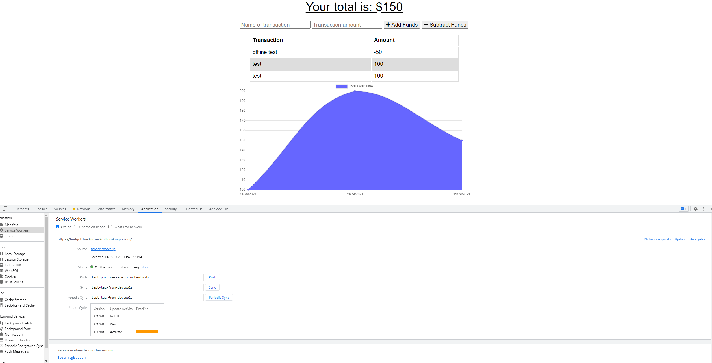

# Budget-Tracker
This app allows the user to add and deduct expenses from their budget and displays their spending and earnings in an on screen graph. It uses a service worker and indexedDB to save the budget updates while user is offline using the indexedDB and updates when online.

Live link: https://budget-tracker-nickm.herokuapp.com/

